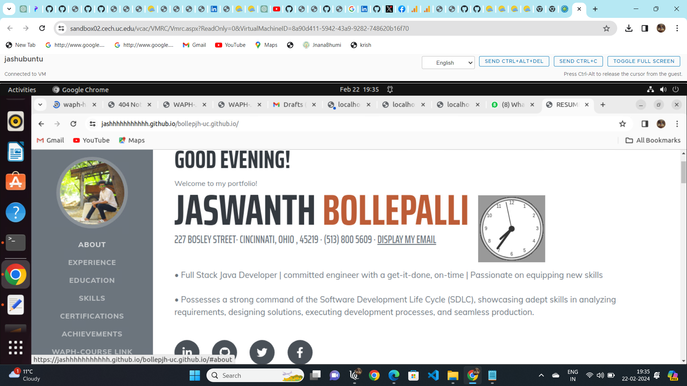
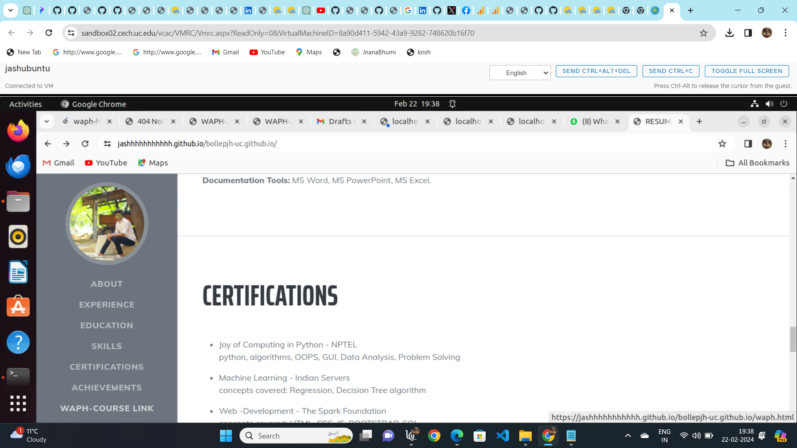
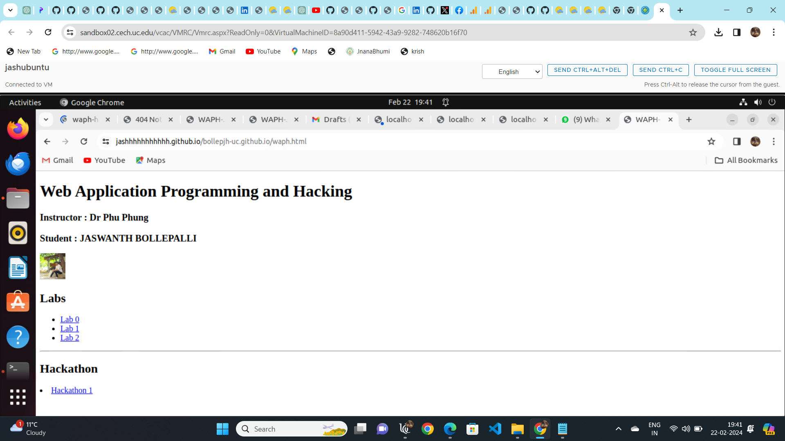
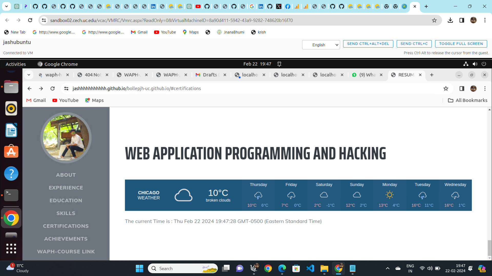
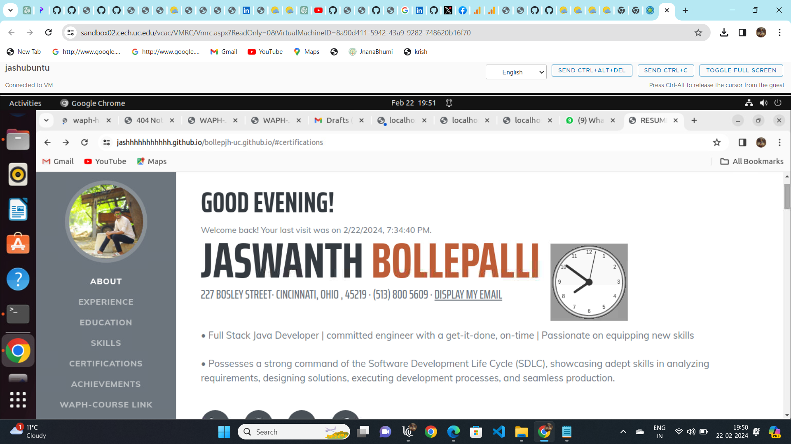
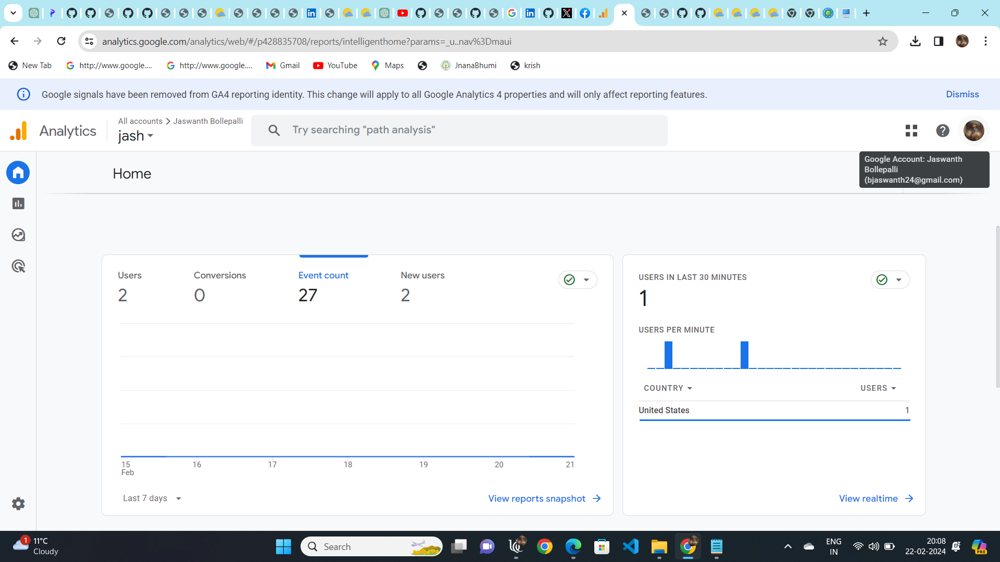

# waph-labs/lab2-jaswanthbollepjh
# Web Applications Programming and Hacking ---- WAPH
## instructors name is: Dr. Phu Phung
**NAME**: Jaswanth Bollepalli
**Email-id**: bollepjh@mail.uc.edu 

 URL FOR MY REPO follows : [https://github.com/jashhhhhhhhhhh/bollepjh-uc.github.io](https://github.com/jashhhhhhhhhhh/bollepjh-uc.github.io)

This is only my private repo for Jaswanth Bollepalli to keep all of the code from the waph course for all LABS . The contents and information of this current repository is as follows.

### indivial student project-1 - professional portfolio 
This project centers on crafting a professional profile website for front-end web development using the github.io cloud service. Within this scope, I've built a personal portfolio and launched it on GitHub's cloud platform. Technical specifications encompass the application of elementary JavaScript code, JQuery, and the React library. Additionally, integration of two public web APIs and the implementation of JavaScript cookies for user recognition and personalized greetings upon revisits are key components. Non-technical prerequisites involve adopting an open-source Bootstrap framework and integrating Google Analytics for page tracking.

my public repo : [https://github.com/jashhhhhhhhhhh/bollepjh-uc.github.io/edit/main/README.md](https://github.com/jashhhhhhhhhhh/bollepjh-uc.github.io/edit/main/README.md)

A link to a new HTML page showcasing completed Hackathons and Labs as part of the WAPH coursework has been added. Additionally, this portfolio encompasses a professional profile featuring my resume, complete with name, headshot, contact details, and background information such as education, experiences, and skills.This portfolio consists of a professional profile with my resume, including name, headshot, contact information, background (e.g., education), my experiences, and skills. To create the personal portfolio, I have downloaded a predefined Bootstrap template from https://startbootstrap.com/theme/resume and customized it as per the project requirements.

my portfolio link : [https://jashhhhhhhhhhh.github.io/bollepjh-uc.github.io/](https://jashhhhhhhhhhh.github.io/bollepjh-uc.github.io/)

### general portfolio requirements 
 1. here i created my portfolio webpage which have basic information about my professional educational career and my skills and experiences and i deployed my website on github.io and it also includes my headshot
.

 2. here more over i created a clickable waph course link which contain all my previous work of my waph course.
.

.
upon clicking the waph course link it will redirect to all my course work
.

### non technical portfolio requirements 

