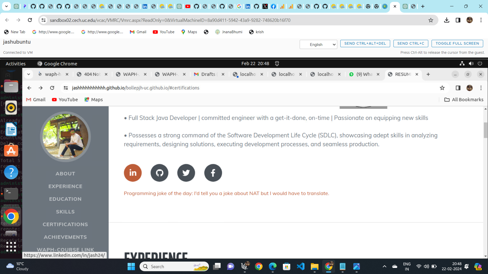
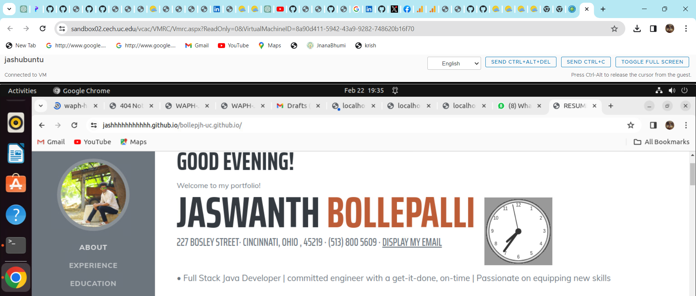

# waph-individualproject-jaswanthbollepjh
# Web Applications Programming and Hacking ---- WAPH
## instructors name is: Dr. Phu Phung
**NAME**: Jaswanth Bollepalli
**Email-id**: bollepjh@mail.uc.edu 


 URL FOR MY REPO follows : [https://github.com/jashhhhhhhhhhh/bollepjh-uc.github.io](https://github.com/jashhhhhhhhhhh/bollepjh-uc.github.io)

This is only my private repo for Jaswanth Bollepalli to keep all of the code from the waph course for all LABS . The contents and information of this current repository is as follows.

### indivial student project-1 - professional portfolio 
This project centers on crafting a professional profile website for front-end web development using the github.io cloud service. Within this scope, I've built a personal portfolio and launched it on GitHub's cloud platform. Technical specifications encompass the application of elementary JavaScript code, JQuery, and the React library. Additionally, integration of two public web APIs and the implementation of JavaScript cookies for user recognition and personalized greetings upon revisits are key components. Non-technical prerequisites involve adopting an open-source Bootstrap framework and integrating Google Analytics for page tracking.

my public repo : [https://github.com/jashhhhhhhhhhh/bollepjh-uc.github.io/edit/main/README.md](https://github.com/jashhhhhhhhhhh/bollepjh-uc.github.io/edit/main/README.md)


A link to a new HTML page showcasing completed Hackathons and Labs as part of the WAPH coursework has been added. Additionally, this portfolio encompasses a professional profile featuring my resume, complete with name, headshot, contact details, and background information such as education, experiences, and skills.This portfolio consists of a professional profile with my resume, including name, headshot, contact information, background (e.g., education), my experiences, and skills. To create the personal portfolio, I have downloaded a predefined Bootstrap template from https://startbootstrap.com/theme/resume and customized it as per the project requirements.


my portfolio link : [https://jashhhhhhhhhhh.github.io/bollepjh-uc.github.io/](https://jashhhhhhhhhhh.github.io/bollepjh-uc.github.io/)

### general portfolio requirements 
1. here i created my portfolio webpage which have basic information about my professional educational career and my skills and experiences and i deployed my website on github.io and it also includes my headshot
.


2. here more over i created a clickable waph course link which contain all my previous work of my waph course.
.


.

upon clicking the waph course link it will redirect to all my course work
.


### non technical portfolio requirements 
1. here i attached css and bootstrap direct links to get good responsive websites pages having many funtionalities such as adding my social media links and its also have a stack containging various clickable links with good visuals.
.


2.here i attached the page tracker information of my portfolio page by adding it to google analytics website and this screenshot shows how many people are currently on this page and how many people are visited till now.
.


### portfolio Technical_requirements
# my basic java_script codes
1. my portfolio digital clock : here i used react.js code to show digital clock. in this screenshot digital clock is shown below the dynamic weather icon.
code c ```<script src="https://cdn.jsdelivr.net/npm/bootstrap@5.2.3/dist/js/bootstrap.bundle.min.js"></script>```
. 
here in upcoming screenshots digital, analog and hide my email functionalities and my funtionality of my choice is downloading users resume using one click.
. are shown by using the respective js and react.js code
.
.

.

.
.
here two public apis are used joke api and weather forecast report api 
1. my portfolio integrated with joke api is shown in below figure which changes the joke every minute
.


2.my portfolio integrated with weather forecast api is shown below in the screenshot 
.


### here i used javascript cookies to record the users visit to my page 
in the below screenshot it shows welcome to my page for first visit
javascript _coookies are added to page to record visits 
code ```function getCookie(name) {
            let cookieName = name + "=";
            let decodedCookie = decodeURIComponent(document.cookie);
            let ca = decodedCookie.split(';');
            for(let i = 0; i <ca.length; i++) {
                let c = ca[i];
                while (c.charAt(0) == ' ') {
                    c = c.substring(1);
                }
                if (c.indexOf(cookieName) == 0) {
                    return c.substring(cookieName.length, c.length);
                }
            }
            return "";
        }```
        
.


in the below screenshot it shows welcome back to my page for the frequent visit after their first visit 
.


